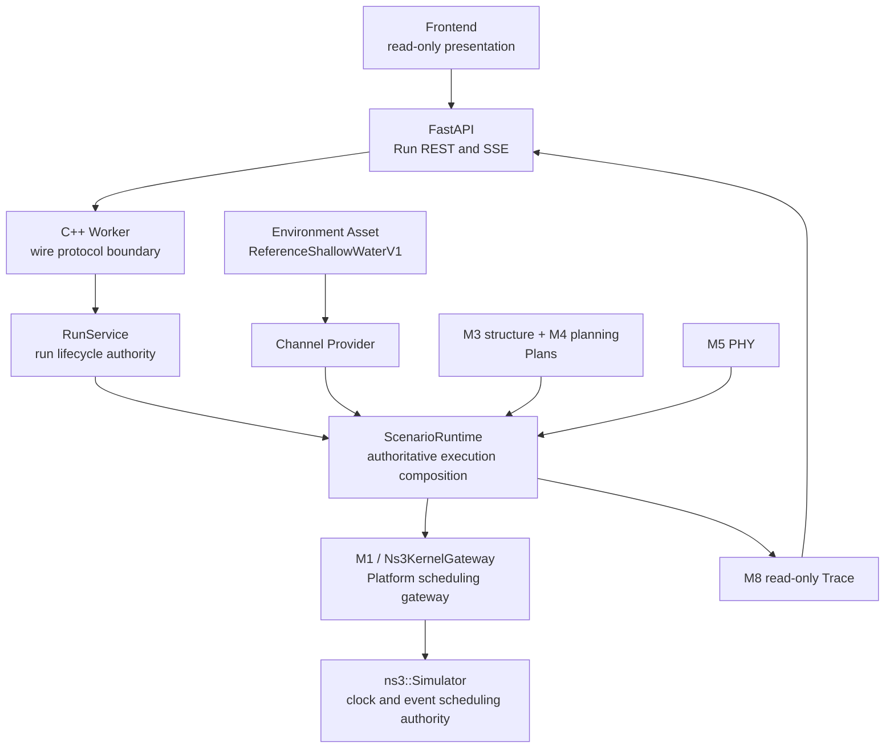

# Acceptance Runtime Architecture Evidence



Environment 不标记为 M6。M6 是 External/HIL adapter 边界，当前不在验收主链。
Frontend、FastAPI、SSE 和 M8 只负责操作或观察，不获得仿真调度权。

## ns-3 execution evidence

- Simulation clock authority：`ns3::Simulator`。
- Event scheduling authority：`ns3::Simulator`。
- Platform scheduling gateway：`M1 / Ns3KernelGateway`。
- `Platform/kernel/internal/ns3_kernel_gateway.hpp` 的边界调用
  `Simulator::Now`、`Schedule`、`Run`、`Stop`、`Destroy`。
- `platform_ns3_kernel_smoke_test` 验证 kernel boundary。
- `platform_ns3_event_dispatcher_test` 与 batch test 验证 phase/stable-order dispatch。
- `platform_ns3_signal_lifecycle_integration_test` 验证真实信号生命周期。
- `platform_assembly_ns3_gateway_multirun_test` 验证 sequential Run 与时间 reset。
- `platform_ns3_acceptance_scenario_integration_test`、
  `platform_ns3_acceptance_fusion_integration_test` 和真实 Worker HTTP integration
  验证 Acceptance4Node 的 ns-3 ON 执行链。

证据重点是实际运行机制，而不是源码目录名称。当前 Linux P0 release 要求验收机提供
ns-3.47 prefix；Worker 实际链接并运行该 ns-3.47。release 不在运行时下载依赖。

## Bellhop/environment boundary

```text
WOA23 + GEBCO 2020
  -> normalized environment
  -> offline Bellhop
  -> arrival file
  -> existing parser/normalizer
  -> immutable AcousticFieldAsset
  -> runtime Channel Provider query
```

正式资产为 `reference-shallow-water-v1`，FNV1A64
`fb64e543f9042c52`，25 kHz，0–2500 m coverage，650 cells，其中
625 Signal、25 NoArrival。它是 **Reference/proxy modeled environment**，传播证据为
**Bellhop-derived propagation**。现场 Run 不执行 Bellhop，也不把 Reference 数据描述成
项目现场采集结果。
